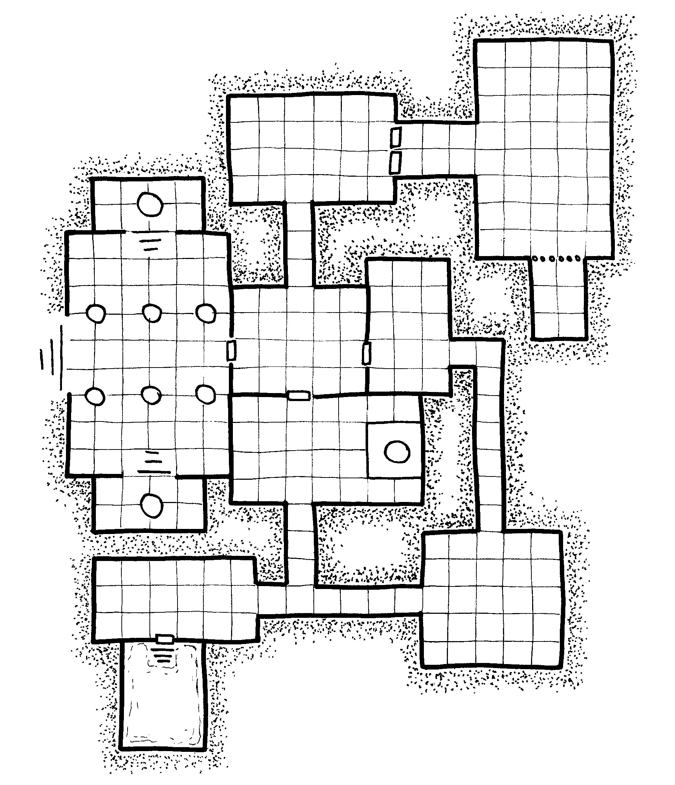
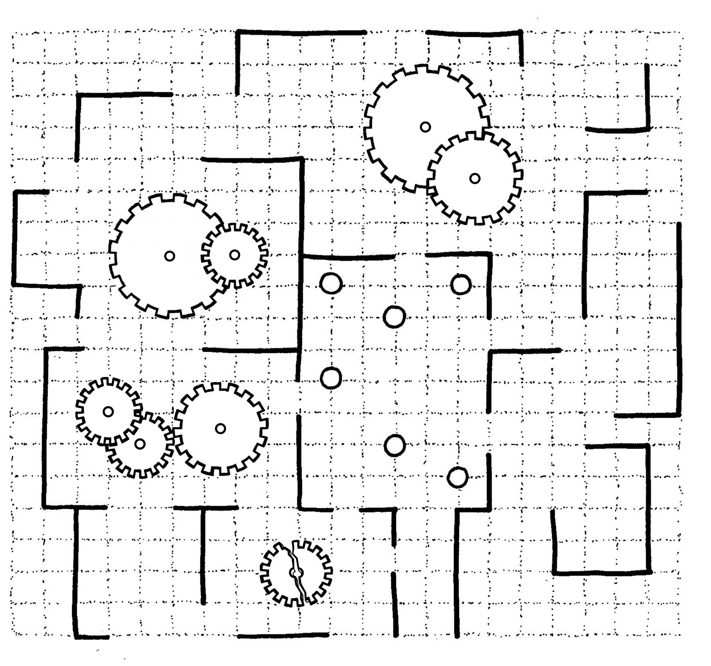
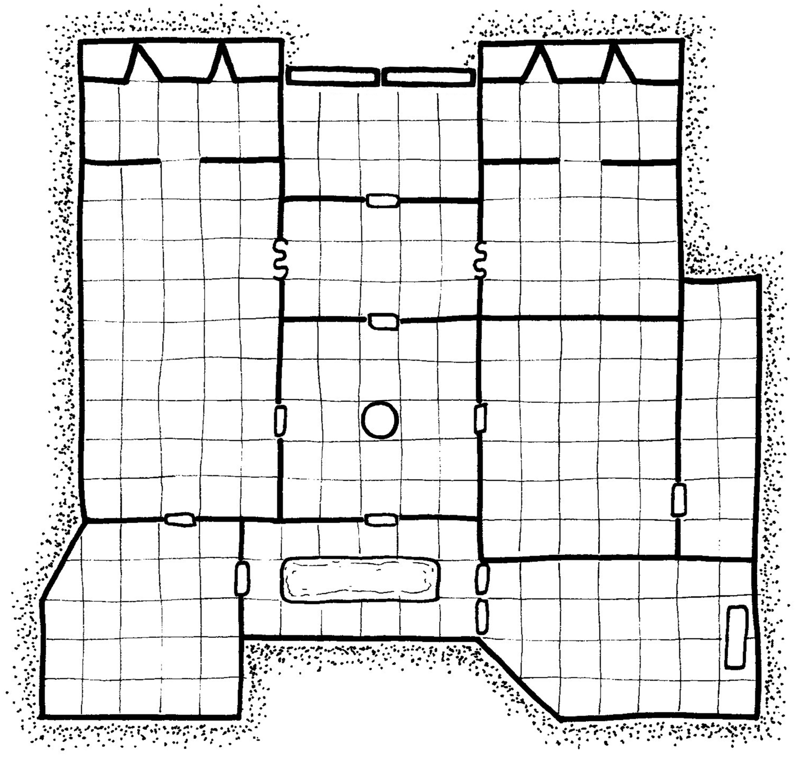

# Locations Index

index-type:: Locations campaign:: [[River of Night]] status:: Active

#index #locations #river-of-night

This index tracks all significant locations discovered in the River of Night campaign.

---

## Safe Havens

### [[Mivvin's Rest]]

- **Type:** Plantation Estate
- **Status:** Active, Threatened
- **First Appearance:** [[Session 01 - The House on Mivvin's Rest]]
- **Owner:** [[Lady Johnson]]
- **Notable Features:** Main house, servants' quarters, gardens, defensive walls
- **Factions:** [[League of Extraordinary Gentlemen]], [[Albion Dominion]]
- **Sessions:** 01, 03, 05, 06, 07 #location #safe-haven #plantation #mivvins-rest

### [[Governor's Clearing]]

- **Type:** Military Outpost
- **Status:** Active (Albion Dominion)
- **First Appearance:** [[Session 06 - The Albion Dominion]]
- **Commander:** [[Colonel Huzzard]]
- **Purpose:** Colonial administration, military base
- **Sessions:** 06, 07 #location #safe-haven #military #albion-dominion
  ***

## Dungeons & Temples

### [[The House on Mivvin's Rest]] (Puzzle Mansion)

- **Type:** Haunted House / Puzzle Dungeon
- **Status:** Cleared
- **First Appearance:** [[Session 01 - The House on Mivvin's Rest]]
- **Creator:** [[Alistair Johnson]] (deceased)
- **Challenges:** Mirror room, dining hall puzzles, candelabra solutions
- **Rewards:** 2000 GP, Knowledge of [[The Serpent's Eye]]
- **Sessions:** 01 #location #dungeon #puzzle #cleared #haunted-house

### [[The Serpent's Eye]]

- **Type:** Basilisk Temple (Underground)
- **Status:** Cleared, Cult Destroyed
- **First Appearance:** [[Session 04 - The Serpent's Eye]]
- **Occupants:** [[Basilisk Cult]], [[Cult Leader]], [[High Priestess]]
- **Challenges:** Invisible bridge, basilisk nursery, cult confrontation
- **Rewards:** Cult treasure, saved [[Durgan Coalbeard]]
- **Sessions:** 04, 05
- **Details:** [[dungeons/Basilisk Cult|Full Dungeon Details]]
- **Map:** [Basilisk Cult Map](maps/map_basilisk_cult.png)

#location #dungeon #temple #cleared #basilisk-cult

### [[Star Map Temple]]

- **Type:** Ancient Observatory Temple
- **Status:** Partially Explored
- **First Appearance:** [[Session 06 - The Albion Dominion]]
- **Guardian:** [[Maied]] (deceased)
- **Features:** Magical star map, celestial navigation, jungle guardian
- **Sessions:** 06, 07
- **Details:** [[dungeons/Star Map Temple|Full Dungeon Details]]
- **Map:** [Star Map Temple Map](maps/map_star_temple.png)

#location #dungeon #temple #active #jungle-spirits

### [[Army Ants]]

- **Type:** Flooded Underground Tomb
- **Status:** Unexplored
- **Hex Location:** 1617
- **Difficulty:** Level 3 characters
- **Author:** Baron de Ropp
- **Occupants:** [[Ejami]] (wight warlord), undead warriors, giant ants, mushroomfolk
- **Features:** Ancient warriors cursed to unlife, peaceful ant family, lichen forest
- **Notable Treasure:** [[Eye of Ejami]] (garnet that grants see invisible & sense undead), 500 gp, blue pearl
- **Factions:** Giant ants vs. mushroomfolk conflict, undead guardians
- **Details:** [[dungeons/Army Ants|Full Dungeon Details]] #location #dungeon #tomb #undead #unexplored #pale-queen

### [[Black Ziggurat]]

- **Type:** Void Being Temple / Transformation Chamber
- **Status:** Unexplored
- **Hex Location:** 514
- **Difficulty:** Level 6 characters
- **Occupants:** Void beings, void bats
- **Features:** [[The Nexus]] (transforms living to void beings), hibernation chambers, void craft hangar
- **Notable Treasure:** Lightning bolt cannons, Onyx Destrier, void craft
- **Warning:** The Nexus transformation is irreversible except by divine intervention
- **Connection:** [[Shune the Vile]] interfered here (creating [[Obe-Ixx]])
- **Eclipse Connection:** One of three obsidian temples that release void beings during eclipses
- **Details:** [[dungeons/Black Ziggurat|Full Dungeon Details]] #location #dungeon #temple #void-beings #unexplored #dangerous #eclipse

### [[Chanichu]]

- **Type:** Volcano / Skandrill Nest
- **Status:** Unexplored
- **Hex Location:** 1405
- **Difficulty:** Level 4 characters
- **Occupants:** Skandrill (crocodile-birds), Skandrill Rex, [[Bizzbol]] (azer), [[Dmitri]] (researcher)
- **Features:** Lava pools, skandrill nests, treasure hoards
- **Notable Treasure:** Skandrill eggs (100 gp each), precious metal chains (d100 gp each), gold bricks, rubies
- **Connection:** Lava flows to [[The Confluence]] (Hex 1309) where it meets the Black River
- **NPCs:** Dmitri conducting dangerous scientific experiment in skandrill costume
- **Details:** [[dungeons/Chanichu|Full Dungeon Details]] #location #dungeon #volcano #wilderness #unexplored #treasure

### [[Eclipse Dial]]

- **Type:** Obsidian Temple / Apocalypse Device
- **Status:** Unexplored
- **Hex Location:** 1603
- **Difficulty:** Level 7 characters
- **Occupants:** Void beings, void craft, prisoner (Caleka)
- **Features:** [[The Wheel]] (causes solar eclipse), void craft hangar, intel room, decontamination
- **Warning:** EXTREMELY DANGEROUS - The Wheel can trigger week-long eclipse and void being apocalypse
- **Activation:** Living humanoid must die by exsanguination on The Wheel's spindle
- **Eclipse Result:** Total solar eclipse for one week, void beings emerge from all obsidian temples
- **Notable Treasure:** Immovable Rod, void craft (flying vehicle)
- **Connection:** [[Lord Hedron]] recruits adventurers to explore for [[Obe-Ixx]]
- **Opposition:** Village of [[Bibolga]] (Hex 1302) guards against intruders
- **Eclipse Connection:** One of three obsidian temples (with [[The Black Seed]] and [[Black Ziggurat]])
- **Details:** [[dungeons/Eclipse Dial|Full Dungeon Details]] #location #dungeon #temple #void-beings #unexplored #apocalyptic #eclipse

### [[Flooded Ruins]]

- **Type:** Basalt Temple / Shune's Ziggurat
- **Status:** Unexplored
- **Hex Location:** 1015
- **Difficulty:** Level 4 characters
- **Author:** Baron de Ropp
- **Occupants:** [[Kawitzek]] (dire snapping turtle), ghosts, skeletons, crocodiles
- **Features:** Temple to [[Shune the Vile]], flooded chambers, purple lotus garden
- **Notable Treasure:** [[Shune's Vestments]] (purple robes granting undead immunity), 200 sp, rope, explorer's journal
- **Warning:** Shune's Vestments compel wearer to kill an innocent daily
- **Reputation:** Locals of [[Tiwara]] (Hex 716) view as accursed, haunted by lost explorers
- **Architecture:** Foreign to Itzalca design, predates or originates from different culture
- **Key Required:** Arm wearing [[Rokara]]'s gold armband (Hex 812) opens tower door
- **Details:** [[dungeons/Flooded Ruins|Full Dungeon Details]] #location #dungeon #temple #shune #unexplored #haunted #cursed

### [[The Black Seed]]

- **Type:** Obsidian Tower / Void Being Army Barracks
- **Status:** Unexplored
- **Hex Location:** 213
- **Difficulty:** Level 10 characters
- **Occupants:** 84 hibernating void beings (28 per level)
- **Features:** Three levels with laser/sound/heat sensors, hibernation tanks, activation sequence
- **Eclipse Open:** Tower opens like flower petals during solar eclipse, releasing void beings
- **Guardian Village:** [[Utzimatu]] (Hex 215) stops people from entering
- **Sensors:**
  - Level 1: Motion sensors (moving faster than half speed triggers)
  - Level 2: Sound sensors (louder than breathing triggers)
  - Level 3: Heat sensors (warm bodies near tanks trigger)
- **Activation Sequence:** 2d4 tanks per round expel void beings once triggered
- **Treasure:** Void Junk table (includes Kytherian Cog, Obsidian Witchknife, magic items)
- **Warning:** MAXIMUM DANGER - 84 void beings, catastrophic if activation sequence triggered
- **Eclipse Connection:** One of three obsidian temples (with [[Eclipse Dial]] and [[Black Ziggurat]])
- **Details:** [[dungeons/The Black Seed|Full Dungeon Details]] #location #dungeon #temple #void-beings #unexplored #apocalyptic #eclipse

### [[The Lost City of Zuchotl|Zuchotl]]

- **Type:** Ancient Lost City / Ruined Citadel
- **Aliases:** Zuchotl, The Lost City of Zuchotl
- **Status:** Abandoned, Partially Occupied by Outcasts
- **First Mentioned:** [[Session 06 - The Albion Dominion]]
- **Location:** Hex 92-1 (Hex 921 in module), west of [[Tsibalba Volcano|Tsibalba]]
- **History:**
  - Ancient seat of power for all Itzalca people (over 1,000 years ago)
  - Destroyed by the Pale Queen leading Azarummian warriors (Hex 006)
  - Itzalca scattered to the wind after the fall
  - Built the [[Star Map Temple]] (Hex 1106) before their downfall
- **Architecture:**
  - Towering citadel of green and red stone (jade and red jasper)
  - Exquisitely carved halls
  - Advanced wonders of magic and science
  - Depicted in [[Star Map Temple]] frescoes with [[Tsibalba Volcano|Tsibalba]] visible in background
- **Current State:**
  - Eerie, abandoned halls left to rot
  - Small tribes of criminals and outcasts now inhabit parts
  - Internal tribal warfare over territory and revenge
  - Much treasure remains lost and hidden
- **Notable Items:**
  - **The Orb of All-Eyes** - Globe that elevates INT and WIS to 18 (still lost)
  - Unknown magical and scientific wonders
- **Significance:**
  - Target of [[Colonel Huzzard]]'s military expedition
  - Key to understanding ancient Itzalca civilization
  - Connected to [[Star Map Temple]] and celestial prophecies
- **Associated NPCs:** [[Alistair Johnson]] (had maps/knowledge), [[Colonel Huzzard]]
- **Factions:** Criminal outcasts, tribal groups (details unknown)
- **Dangers:** Tribal warfare, ancient traps, lost magic, structural decay
- **Sessions:** 06 (mentioned), 07 (expedition planned) #location #dungeon #lost-city #itzalca #ruins #zuchotl #pale-queen
  ***

## Wilderness & Regions

### [[Tsibalba Volcano|Tsibalba]]

- **Type:** Active Volcano / Salamander Temple
- **Aliases:** Tsibalba, Tsibalba Volcano
- **Status:** Active, Dangerous
- **Location:** Hex 12-2 (Hex 122 in module)
- **First Mentioned:** [[Session 06 - The Albion Dominion]] (Star Map Temple fresco)
- **Inhabitants:** The Skirrim (Salamander tribe)
- **Features:**
  - Trembling volcano spitting lava day and night
  - Black basalt fortress temple within caldera
  - Lava tubes connecting to nearby hexes
  - Visible silhouette from [[The Lost City of Zuchotl|Zuchotl]]
- **Occupants:**
  - The Skirrim salamanders (militant fire-worshippers)
  - [[Baraz]] - Salamander elder/priest (Level 9, worships Ramlaat)
  - Temple guards and warriors
- **Notable Items:**
  - **Rothak** - Iron +1 longbow that ignites arrows (+1d4 fire damage)
  - Giant ruby in Ramlaat statue (200 gp)
  - Prophetic lava pool (grants luck token)
  - Kytherian Cog (worn by Baraz)
  - Amulet of Vitality (salamander guard)
- **Dangers:**
  - Heavily fortified iron gate (20' high with spikes)
  - Multiple salamander guards and patrols
  - Living sacrifice rituals to Ramlaat
  - Lava pools and heat hazards
- **Connections:** Lava tubes (Hex 12-0/120) lead to volcano base
- **Sessions:** 06 (mentioned in fresco)
- **Details:** [[dungeons/Tsibalba|Full Dungeon Details]]
- **Map:** [Tsibalba Map](maps/map_tsibalba.png)

#location #wilderness #volcano #dungeon #salamanders #tsibalba #dangerous

### [[The Green Hell]]

- **Type:** Jungle Wilderness
- **Status:** Dangerous, Active
- **First Appearance:** [[Session 02 - The Proving Ground]]
- **Threats:** Jungle beasts, hostile plants, [[Jungle Spirits]]
- **Notable Events:** [[The Proving Ground]] trial, [[Maied]] encounters
- **Sessions:** 02, 06, 07
- **Hex Maps:** [West Region](maps/hexmap_black_river_west.jpeg) | [East Region](maps/hexmap_black_river_east.jpeg) #location #wilderness #jungle #dangerous #green-hell

### [[The Black River]]

- **Type:** River / Trade Route
- **Status:** Active
- **First Appearance:** Campaign Background
- **Significance:** Main waterway, campaign namesake
- **Sessions:** Referenced throughout
- **Hex Maps:** [West Region](maps/hexmap_black_river_west.jpeg) | [East Region](maps/hexmap_black_river_east.jpeg) #location #wilderness #river #trade-route

### [[The Proving Ground]]

- **Type:** Jungle Trial Area
- **Status:** Active (League Test)
- **First Appearance:** [[Session 02 - The Proving Ground]]
- **Purpose:** [[League of Extraordinary Gentlemen]] membership test
- **Challenges:** Jungle survival, beast encounters
- **Result:** [[Doctor Googoo]] failed, others passed
- **Sessions:** 02 #location #wilderness #trial #league-test
  ***

## Quick Reference by Session

- **Session 01:** [[Locations#Mivvin's Rest]], [[The House on Mivvin's Rest]]
- **Session 02:** [[The Proving Ground]], [[The Green Hell]]
- **Session 03:** [[Locations#Mivvin's Rest]] (night raid defense)
- **Session 04:** [[The Serpent's Eye]] (infiltration)
- **Session 05:** [[The Serpent's Eye]] (nursery chaos)
- **Session 06:** [[Governor's Clearing]], [[Star Map Temple]], [[The Green Hell]], [[Zuchotl]] (mentioned), [[Tsibalba Volcano]] (mentioned)
- **Session 07:** [[Governor's Clearing]], [[Star Map Temple]], [[Locations#Mivvin's Rest]], [[Zuchotl]] (mentioned)

  ***

## Related

- [[FACTIONS]] - Faction control of locations
- [[Timeline]] - Chronological location discoveries
- [[NPC_DIRECTORY]] - NPCs by location
- [[CAMPAIGN]] - Campaign overview
